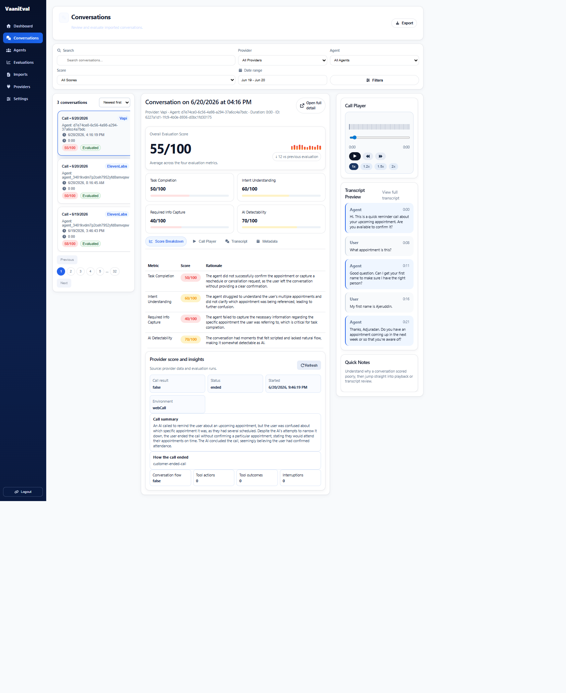
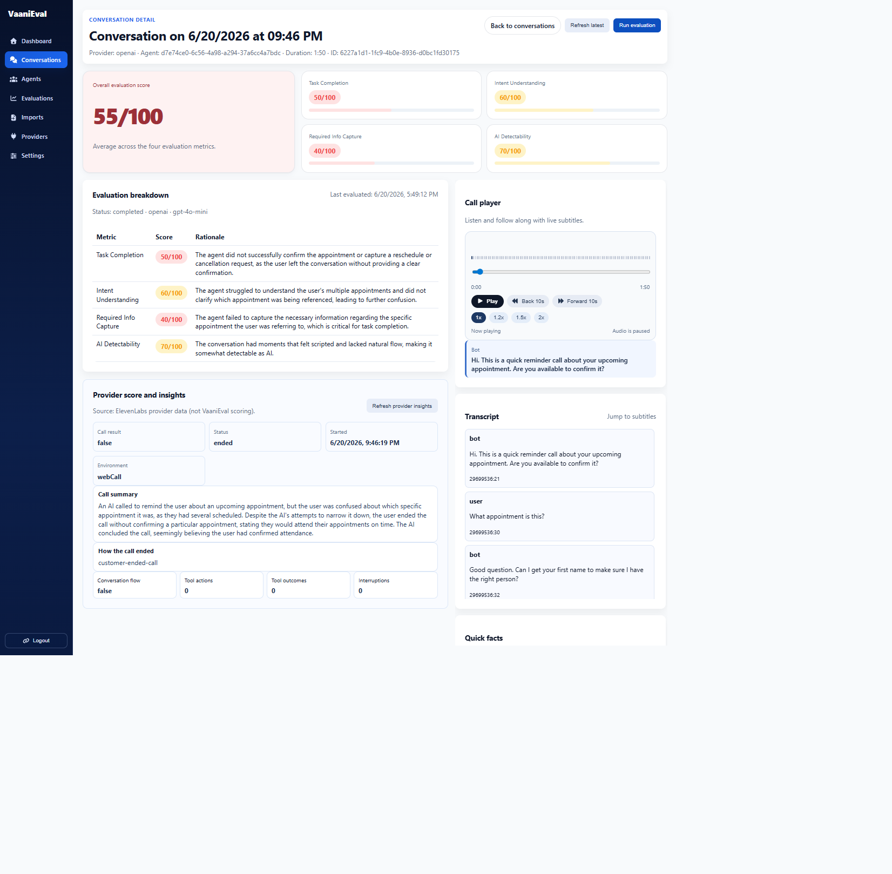
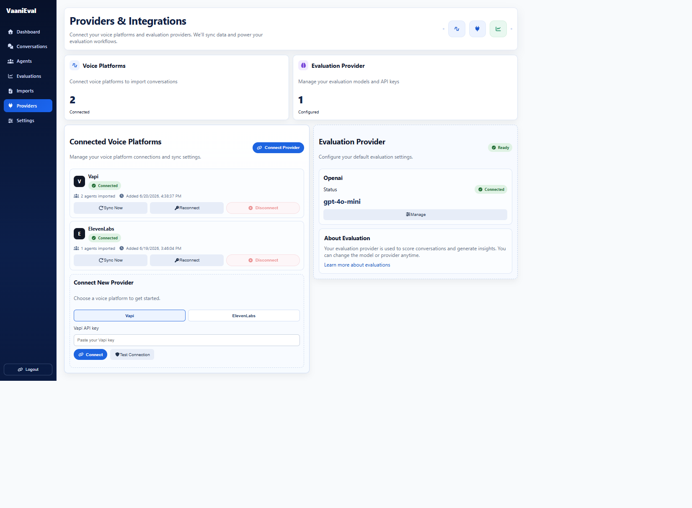

# VaaniEval

Production evaluation platform for voice agents.

VaaniEval is an open-source evaluation stack for teams that want to measure real conversation quality using production data across both ElevenLabs and Vapi.

## Why VaaniEval

Most voice teams need more than a single pass/fail number. They need replayable evidence, clear score breakdowns, and a workflow that helps QA, product, and engineering ship improvements faster.

VaaniEval gives you:

- Real conversation ingestion (historical + ongoing imports)
- Conversation review workspace with transcript + audio playback
- Evaluation runs with metric-level rationale
- Configurable voice providers and evaluator providers
- Queue-backed processing for reliability at scale

## Product Snapshot

- Frontend: React + Vite
- Backend API: FastAPI + SQLAlchemy
- Worker: DB-backed async job processing
- Voice providers: ElevenLabs and Vapi
- Evaluation provider: configurable, with OpenAI-first defaults
- Storage: SQLite in local dev (extensible to managed DB)

## Screenshots

<details>
<summary>Screenshots</summary>

### Conversations Overview



### Conversation Detail



### Provider Settings



</details>

## Demo

<details>
<summary>Walkthrough</summary>

The repo does not include a bundled demo video yet, so this section stays lightweight and easy to expand later.

- Start the app from [docs/development.md](docs/development.md)
- Connect either ElevenLabs or Vapi from the provider settings page
- Import conversations, review scores, and inspect transcripts in the conversations workspace

</details>

## Quick Start (V2)

For full setup and troubleshooting, see [docs/development.md](docs/development.md).

### Windows

```powershell
./start-dev.cmd
```

or

```powershell
./start-dev.ps1
```

### macOS / Linux

```bash
chmod +x start-dev.sh
./start-dev.sh
```

Services:

- Frontend: http://localhost:5173
- Backend API: http://localhost:8000
- Backend worker: required for imports and evaluations (started by `start-dev` scripts)

If you start services manually, run the worker in a second terminal from `backend/`:

```bash
python -m app.worker
```

## Architecture

For detailed backend internals, see [docs/backend-architecture.md](docs/backend-architecture.md).

Provider support is adapter-based, so adding another voice platform follows the same factory + adapter pattern used for ElevenLabs and Vapi.

Highlights:

- Multi-layer backend (`api`, `services`, `models`, `worker`)
- Queue-driven ingestion and scoring jobs
- Conversation and evaluation run lifecycle tracking
- Encrypted provider credential support

## V2 Planning and Direction

- [V2 Plan Overview](docs/v2-plan/README.md)
- [V2 Roadmap](docs/v2-plan/roadmap.md)
- [V2 Score Taxonomy](docs/v2-plan/score-taxonomy.md)
- [V2 Audio Scalability Plan](docs/v2-plan/audio-scalability-plan.md)

## Documentation

- [Docs Index](docs/index.md)
- [Development Guide](docs/development.md)
- [Backend Architecture](docs/backend-architecture.md)

## Contributing

Contributions are welcome. Start with local setup from [docs/development.md](docs/development.md), then open a PR with:

- Clear problem statement
- Screenshots for UI changes
- Notes on migrations, jobs, or API behavior changes

## License

[LICENSE](LICENSE)
