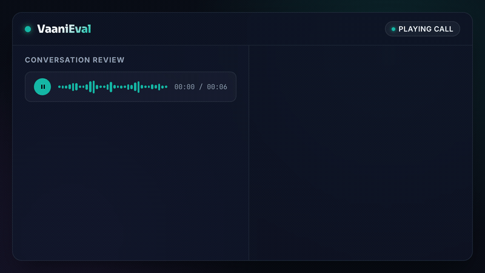

<p align="center">
  
</p>

<h1 align="center"><a href="https://www.vaanieval.com/">VaaniEval</a></h1>

<p align="center">
  Open-source evaluation workspace for production voice AI agents.
</p>

<p align="center">
  <a href="https://www.vaanieval.com/"><strong>Visit VaaniEval</strong></a> ·
  <a href="https://github.com/shubhamofbce/vaanieval"><strong>Star on GitHub</strong></a>
</p>

<p align="center">
  <a href="docs/development.md">Development</a> |
  <a href="docs/architecture.md">Architecture</a> |
  <a href="DEPLOYMENT.md">Deployment</a> |
  <a href="CONTRIBUTING.md">Contributing</a> |
  <a href="https://github.com/shubhamofbce/vaanieval/discussions">Discussions</a>
</p>

<p align="center">
  <a href="LICENSE"></a>
  <a href="backend/requirements.txt"></a>
  <a href="backend/README.md"></a>
  <a href="frontend/package.json"></a>
  <a href="frontend/package.json"></a>
</p>

VaaniEval helps voice-agent teams inspect real conversations, run evaluator-backed quality checks, and turn production call data into actionable QA, product, and engineering feedback.

<p align="center">
  
</p>

VaaniEval is a full-stack application, not a published Python package or supported CLI. It consists of a FastAPI backend, a queue worker, a React product app, and a Next.js public site.

## Product Demo

Watch the [VaaniEval product demo](https://youtu.be/6T0CatDgoEA) for a walkthrough of the conversation review and quality-evaluation workspace.

[](https://youtu.be/6T0CatDgoEA)

## What VaaniEval provides

- Production conversation imports from supported voice providers
- Transcript and audio review in a purpose-built conversation workspace
- Evaluator-backed scores with rationales and conversation evidence
- Dashboard analytics for quality trends, KPIs, and agent-level drilldowns
- Encrypted provider credentials and workspace-scoped data
- Queue-backed imports and evaluations

Use VaaniEval to examine task completion, resolution quality, unsupported claims, fallback behavior, and available operational signals.

<p align="center">
  
</p>

## Quick Start

### Prerequisites

- Python 3.11+
- Node.js 20+ and npm
- Git
- ElevenLabs or Vapi credentials for importing conversations
- Evaluator provider credentials, such as OpenAI, for scoring

### Start the stack

Windows:

```powershell
./start-dev.cmd
```

or:

```powershell
./start-dev.ps1
```

macOS/Linux:

```bash
chmod +x start-dev.sh
./start-dev.sh
```

Services:

- Frontend: http://localhost:5173
- Backend API: http://localhost:8000
- Backend API docs: http://localhost:8000/docs
- Worker: started by the development scripts

### Run an evaluation

1. Open the frontend.
2. Sign in with the local development flow.
3. Connect a voice provider in Provider settings.
4. Import conversations.
5. Open the Conversations workspace.
6. Trigger an evaluation and inspect scores, rationales, transcript, and audio.

For manual setup, configuration, tests, and troubleshooting, see [Development](docs/development.md).

## Supported Integrations

| Integration | Role | Current support |
| --- | --- | --- |
| ElevenLabs | Voice provider | Conversation import, agent discovery, media/transcript review |
| Vapi | Voice provider | Conversation import and provider adapter support |
| OpenAI | Evaluator provider | Default evaluator path |

Provider support is adapter-based. New voice providers should live behind backend provider adapters so provider-specific behavior stays isolated.

## Repository

```text
.
|-- backend/       # FastAPI API, worker, migrations, and provider adapters
|-- frontend/      # Authenticated React product
|-- site/          # Public Next.js acquisition site
|-- datasets/      # Historical evaluation datasets
|-- docs/          # Development and architecture guides
|-- tests/         # Backend, provider, and evaluation tests
`-- start-dev.*    # Local full-stack launchers
```

## Documentation

- [Development](docs/development.md): local setup, configuration, tests, and troubleshooting
- [Architecture](docs/architecture.md): components, data flow, queue, and security boundaries
- [Deployment](DEPLOYMENT.md): production topology and deployment commands
- [Contributing](CONTRIBUTING.md): contribution workflow and required checks

## Security And Privacy

VaaniEval is designed for production conversation review, so treat credentials and call data carefully:

- Never commit real provider API keys or evaluator tokens.
- Keep local secrets in `.env` files that are not tracked.
- Use the backend Provider settings flow for connected provider credentials where possible.
- Configure production database, cookie, SMTP, CORS, and encryption secrets before deployment.

If a credential is exposed, rotate it immediately.

## Contributing

Contributions are welcome. Before opening a pull request, run the relevant checks and read [CONTRIBUTING.md](CONTRIBUTING.md).

## Community

Need help setting up or deploying VaaniEval? Email
[shubham@vaanieval.com](mailto:shubham@vaanieval.com). I am happy to help you
get it running.

Join [GitHub Discussions](https://github.com/shubhamofbce/vaanieval/discussions)
to ask setup and usage questions, compare voice-agent evaluation approaches,
propose ideas, or share what you have built. Use
[GitHub Issues](https://github.com/shubhamofbce/vaanieval/issues) for
reproducible defects and scoped implementation work.

See the [community support guide](.github/SUPPORT.md) for category guidance and
safe-posting expectations.

## License

VaaniEval is licensed under the [MIT License](LICENSE).
