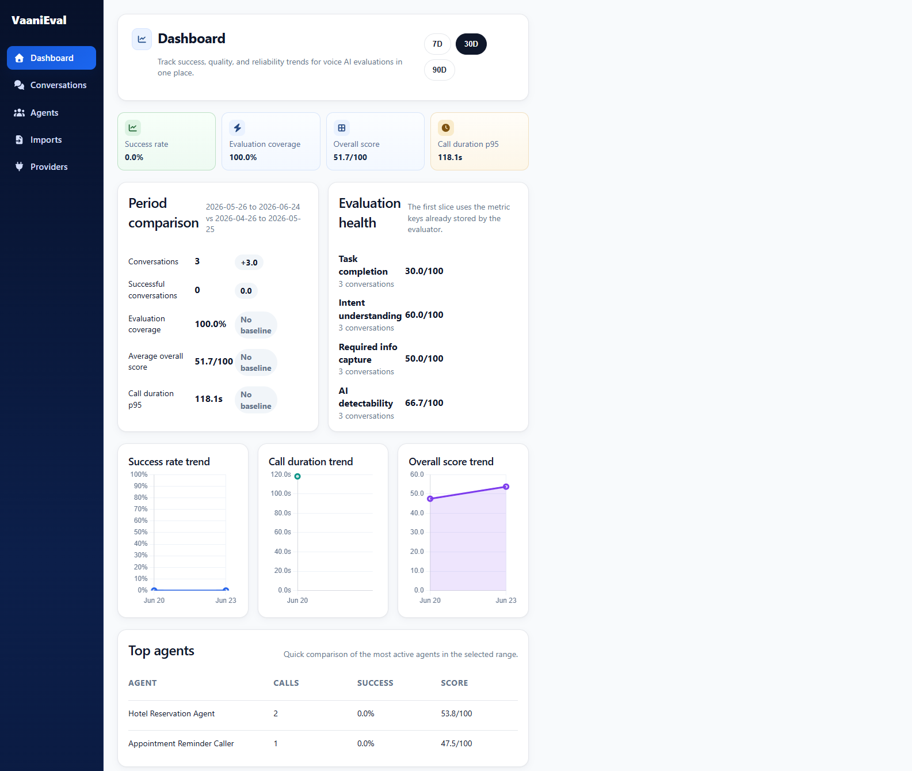
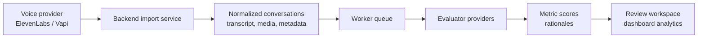
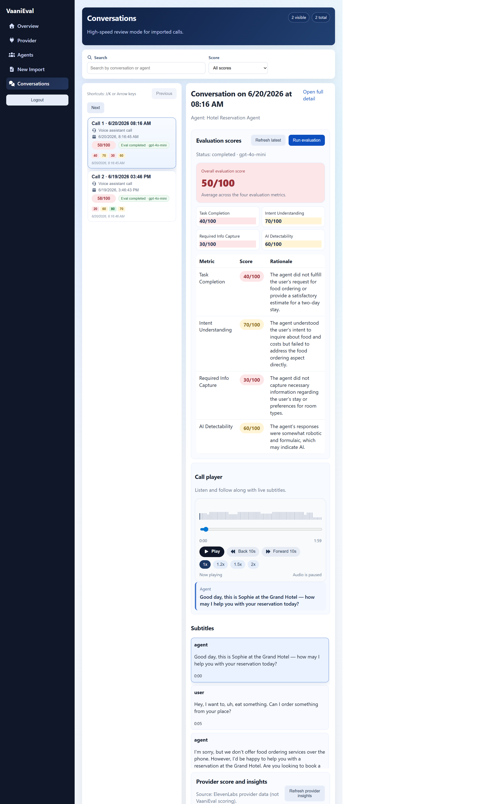
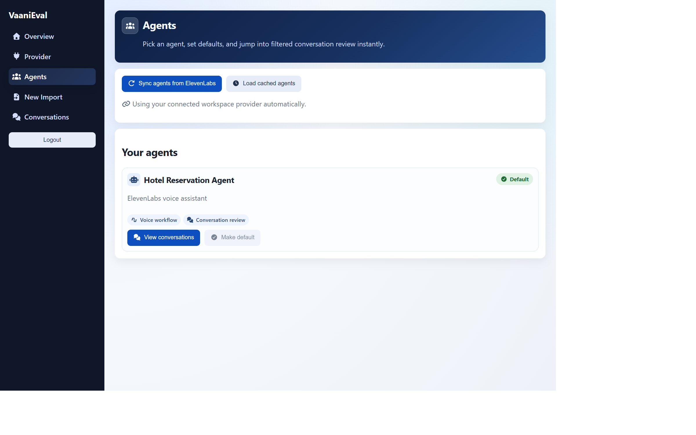
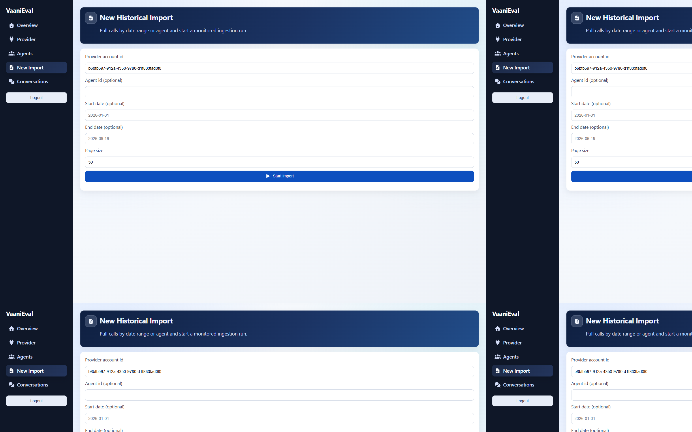
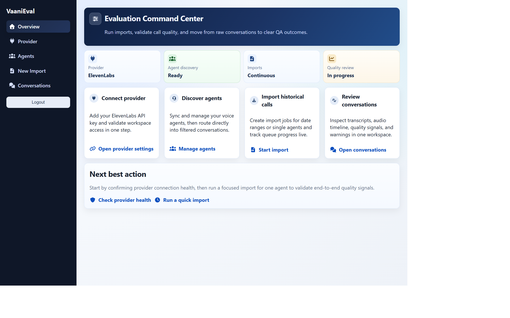

<p align="center">
  
</p>

<h1 align="center"><a href="https://vaanieval.vercel.app/">VaaniEval</a></h1>

<p align="center">
  Open-source evaluation workspace for production Voice AI agents.
</p>

<p align="center">
  <a href="https://vaanieval.vercel.app/"><strong>Try the deployed version</strong></a>
</p>

<p align="center">
  <a href="docs/quickstart.md">Quickstart</a> |
  <a href="docs/development.md">Development</a> |
  <a href="docs/backend-architecture.md">Architecture</a> |
  <a href="docs/metrics-and-gates.md">Metrics</a> |
  <a href="docs/features/README.md">Feature Playbooks</a>
</p>

<p align="center">
  <a href="LICENSE"></a>
  <a href="backend/requirements.txt"></a>
  <a href="backend/README.md"></a>
  <a href="frontend/package.json"></a>
  <a href="frontend/package.json"></a>
</p>

VaaniEval helps voice-agent teams inspect real conversations, run evaluator-backed quality checks, and turn production call data into actionable QA, product, and engineering feedback.

> VaaniEval is currently a full-stack application, not a published Python package. The source of truth is the `backend/` FastAPI service, `frontend/` React app, and backend worker process.



## Why VaaniEval

Most Voice AI teams outgrow pass/fail spot checks quickly. They need a repeatable way to import conversations, review evidence, score behavior, and understand where agents are improving or failing.

VaaniEval gives you:

- Production conversation ingestion from supported voice providers
- Transcript and audio review in a purpose-built conversation workspace
- Evaluation runs with metric scores and rationales
- Dashboard analytics for quality trends, KPIs, and agent-level drilldowns
- Provider settings for voice platforms and evaluator models
- Queue-backed imports and evaluations so long-running work does not block the app

## What You Can Evaluate

Use VaaniEval to review and score conversations for:

- Task completion and resolution quality
- Hallucination or unsupported claims
- Fallback behavior and unresolved turns
- Latency and operational quality signals
- Agent, provider, and conversation-level trends

See [Metrics and Gates](docs/metrics-and-gates.md) for the current metric model.

## Quick Start

### Prerequisites

- Python 3.11+
- Node.js 20+ and npm
- Git
- ElevenLabs or Vapi credentials for importing conversations
- Evaluator provider credentials, such as OpenAI, for scoring

### One-command startup

Windows:

```powershell
./start-dev.cmd
```

or:

```powershell
./start-dev.ps1
```

macOS/Linux:

```bash
chmod +x start-dev.sh
./start-dev.sh
```

Services:

- Frontend: http://localhost:5173
- Backend API: http://localhost:8000
- Backend API docs: http://localhost:8000/docs
- Worker: started by the dev scripts

### First evaluation flow

1. Open the frontend.
2. Sign in with the local development flow.
3. Connect a voice provider in Provider settings.
4. Import conversations.
5. Open the Conversations workspace.
6. Trigger an evaluation and inspect scores, rationales, transcript, and audio.

For manual setup, environment variable, migrations, and troubleshooting, see the [Development Guide](docs/development.md).

## How It Works



## Product Surface

| Area | What it does |
| --- | --- |
| Conversations | Review imported calls with transcript, metadata, audio playback, and evaluation context. |
| Evaluation runs | Score conversations with evaluator-backed metrics and store rationales. |
| Dashboard | Track KPIs, score trends, and top-agent performance. |
| Provider settings | Connect voice providers and evaluator providers. |
| Worker queue | Processes imports and evaluations outside the request lifecycle. |

## Supported Integrations

| Integration | Role | Current support |
| --- | --- | --- |
| ElevenLabs | Voice provider | Conversation import, agent discovery, media/transcript review |
| Vapi | Voice provider | Conversation import and provider adapter support |
| OpenAI | Evaluator provider | Default evaluator path |
| Anthropic / LangChain | Evaluator provider | Backend provider modules available |

Provider support is adapter-based. New voice providers should live behind backend provider adapters so provider-specific behavior stays isolated.

## Tech Stack

| Layer | Stack |
| --- | --- |
| Frontend | React, Vite, TypeScript, React Router, React Query, charting libraries, WaveSurfer |
| Backend API | FastAPI, SQLAlchemy, Alembic, Pydantic |
| Worker | DB-backed queue processor |
| Local storage | SQLite by default |
| Production storage | Designed to support managed databases such as PostgreSQL |

## Screenshots

### Conversations Workspace



### Conversation Detail


### Provider Settings


<details>
<summary>More screenshots</summary>

### Agents



### Import New Conversations



### Onboarding Dashboard



</details>

## Project Layout

```text
.
|-- backend/                 # FastAPI app, models, services, worker, migrations
|-- frontend/                # React + Vite application
|-- docs/                    # Architecture, setup, feature playbooks, metrics
|-- datasets/                # Historical scenario datasets and references
|-- tests/                   # Backend and evaluation tests
|-- start-dev.cmd            # Windows launcher
|-- start-dev.ps1            # Windows PowerShell launcher
`-- start-dev.sh             # macOS/Linux launcher
```

## Documentation

- [Quickstart](docs/quickstart.md)
- [Development Guide](docs/development.md)
- [Backend Architecture](docs/backend-architecture.md)
- [Backend API Reference](docs/cli-and-api.md)
- [Configuration](docs/configuration.md)
- [Metrics and Gates](docs/metrics-and-gates.md)
- [Troubleshooting](docs/troubleshooting.md)
- [Feature Playbooks](docs/features/README.md)
- [V2 Plan](docs/v2-plan/README.md)

## Development

Run backend tests from the repository root:

```bash
pytest
```

Build the frontend:

```bash
cd frontend
npm run build
```

See [docs/development.md](docs/development.md) for the full manual setup.

## Security And Privacy

VaaniEval is designed for production conversation review, so treat credentials and call data carefully:

- Never commit real provider API keys or evaluator tokens.
- Keep local secrets in `.env` files that are not tracked.
- Use the backend Provider settings flow for connected provider credentials where possible.
- Configure production database, cookie, SMTP, CORS, encryption, and cron secrets before deployment.

If a credential is exposed, rotate it immediately.

## Contributing

Contributions are welcome. Good first areas include:

- New provider adapters
- Evaluation metric improvements
- Conversation review UX improvements
- Import and worker reliability
- Documentation and examples

Before opening a PR, run the relevant backend and frontend checks and include screenshots for UI changes. See [docs/contributing.md](docs/contributing.md) for the full contribution guide.

## Roadmap

- [V2 Plan Overview](docs/v2-plan/README.md)
- [V2 Roadmap](docs/v2-plan/roadmap.md)
- [V2 Score Taxonomy](docs/v2-plan/score-taxonomy.md)
- [V2 Audio Scalability Plan](docs/v2-plan/audio-scalability-plan.md)

## License

VaaniEval is licensed under the [MIT License](LICENSE).
