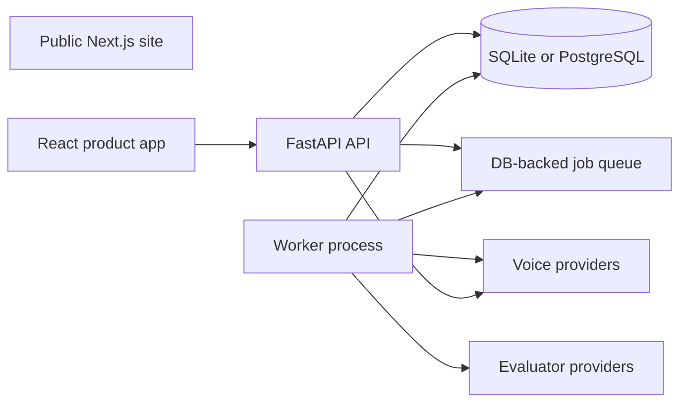

# Architecture

VaaniEval is a full-stack workspace for importing, evaluating, and reviewing production voice-agent conversations.

## Components

- `site/`: public acquisition site deployed separately from the product.
- `frontend/`: authenticated React product.
- `backend/app/main.py`: FastAPI application and HTTP entrypoint.
- `backend/app/api/v1/`: workspace-scoped API routes.
- `backend/app/services/`: auth, imports, evaluation, credentials, and queue orchestration.
- `backend/app/providers/`: ElevenLabs and Vapi adapters.
- `backend/app/models/`: SQLAlchemy persistence models.
- `backend/app/worker.py`: leased queue worker with retries and dead-letter handling.

## Conversation flow

1. A user connects a voice provider and discovers agents.
2. The API creates an import job.
3. The worker fetches provider conversations and normalizes transcripts, metadata, and media references.
4. Evaluation jobs send conversation context to the configured evaluator.
5. Metric scores and rationales are stored with the conversation.
6. The product app presents conversations, evidence, scores, and dashboard aggregates.

## Data domains

- Users, workspaces, memberships, and sessions
- Voice and evaluator provider accounts
- Agents and normalized conversations
- Transcript turns, insights, and media references
- Import jobs, queue jobs, retries, and dead letters
- Evaluation runs and metric scores

## Integration boundaries

Provider-specific behavior belongs in `backend/app/providers/`. Shared API models and persistence models must not depend on provider-native payload shapes.

The API and worker must use the same database. Queue handlers must remain idempotent because jobs can be retried after a failed lease.

## Security boundaries

- API queries and writes are scoped to the authenticated workspace.
- Provider credentials are encrypted before storage.
- Production cookies require secure settings and explicit allowed origins.
- The API and worker share secrets and database access, but only the API is public.
- Conversation data can still be sent to configured voice and evaluator providers; self-hosting does not remove those external data flows.

## Frontend conventions

The canonical design tokens live in `frontend/src/index.css`. Reuse existing components and CSS variables, keep product screens compact, and validate desktop and mobile layouts.

## API reference

FastAPI generates the maintained OpenAPI reference at `/docs` while the backend is running.
