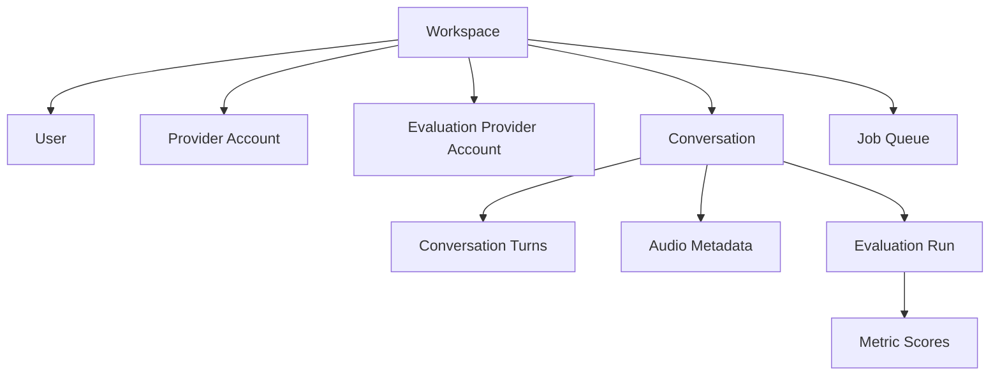
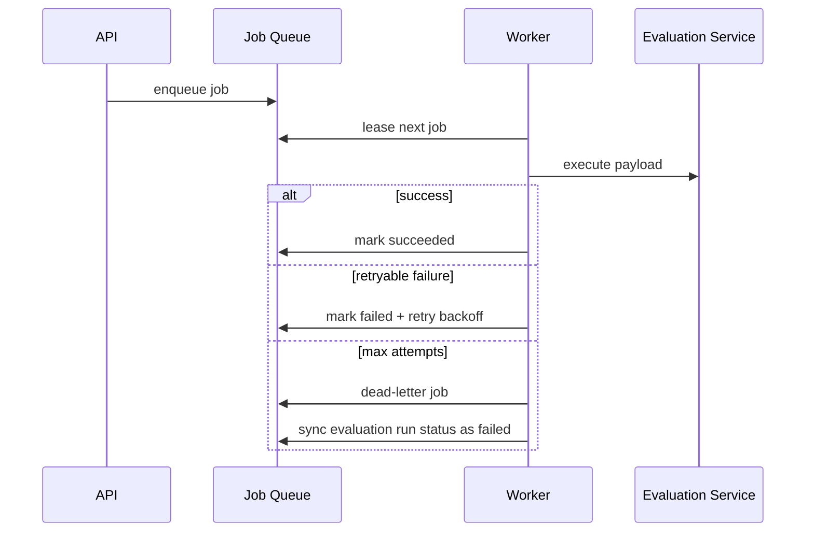

# Backend Architecture (V2)

VaaniEval V2 backend is a layered FastAPI system designed for production conversation ingestion, evaluation, and review across multiple voice providers.

## Architecture Goals

- Provider-first ingestion with normalized internal models and adapter-based integrations for ElevenLabs and Vapi
- Reliable async processing using a DB-backed queue
- Clear evaluation run lifecycle and metric evidence
- Workspace-scoped security and credential boundaries

## High-level flow

```mermaid
flowchart LR
    A[Frontend UI] --> B[FastAPI API]
    B --> C[(SQLite/Postgres DB)]
    B --> D[Job Queue Table]
    D --> E[Worker Process]
    E --> F[Provider APIs\n(ElevenLabs / Vapi)]
    E --> C
    B --> G[Media Stream Endpoint]
    G --> H[Audio Playback UI]
```

## Service boundaries

- `backend/app/api/v1/`: HTTP surface for auth, providers, imports, conversations, media, and evaluations.
- `backend/app/services/`: Business logic for provider calls, imports, credentials, queueing, and evaluation orchestration.
- `backend/app/models/`: SQLAlchemy models for users, workspaces, providers, conversations, queue jobs, evaluation runs, and metric scores.
- `backend/app/worker.py`: Background processor that leases queue jobs, executes handlers, retries failures, and updates run status.

## API layer

Key route groups:

- Auth: magic-link login/session routes
- Provider: account connect/test/agent discovery across ElevenLabs and Vapi
- Imports: historical sync job creation and progress
- Conversations: list/detail retrieval and review payloads
- Media: audio metadata + stream endpoint
- Evaluations: run and fetch conversation evaluations

## Data model overview



Core persisted domains:

- Identity and tenancy (workspace/user/membership)
- Provider connectivity and agent metadata for ElevenLabs and Vapi
- Conversation transcript, metadata and media pointers
- Evaluation runs and per-metric scores
- Queue jobs, attempts, and dead-letter handling

## Queue and worker lifecycle



Behavior highlights:

- Lease-based processing avoids duplicate execution.
- Retries use attempt tracking and max-attempt policy.
- Dead-letter paths propagate failure state back to evaluation runs.

## Evaluation pipeline

1. API creates/queues evaluation run.
2. Worker executes evaluation job.
3. Service fetches conversation transcript context.
4. Provider/model adapter computes metric scores.
5. Scores persist to run-linked metric rows.
6. Run status transitions to `completed` or `failed`.

Provider-specific behavior is isolated behind provider adapters in `backend/app/providers/`, so adding a new voice provider should usually mean implementing a new adapter and wiring it through the factory.

## Security and config

- Workspace scoping is enforced via auth/session context.
- Provider secrets are stored encrypted at rest.
- Runtime configuration comes from backend `.env` values.

Primary env values:

- `DATABASE_URL`
- `SECRET_KEY`
- `CREDENTIAL_ENCRYPTION_KEY`
- `ELEVENLABS_API_BASE`
- `VAPI_API_BASE`
- `OPENAI_API_BASE`

## Operational notes

- API and worker must share the same database.
- Migrations must be applied before startup.
- Worker must stay alive for imports/evaluations to complete.

## Related docs

- [Development Guide](development.md)
- [V2 Plan Overview](v2-plan/README.md)
- [V2 Roadmap](v2-plan/roadmap.md)
