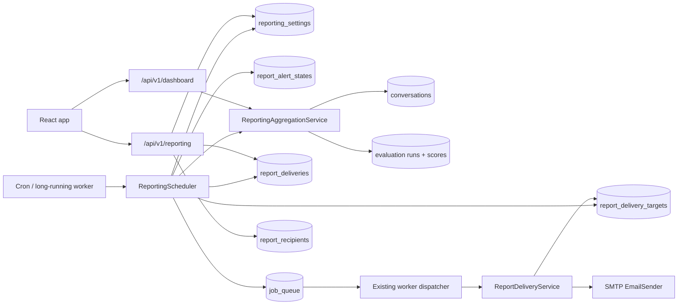
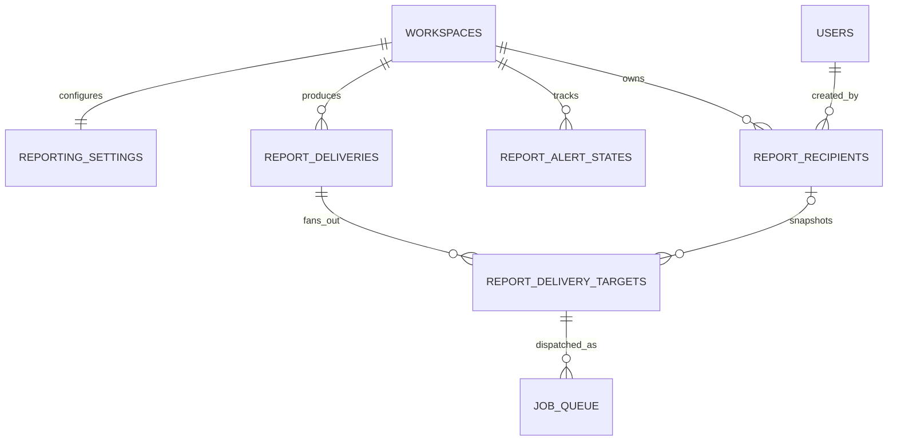
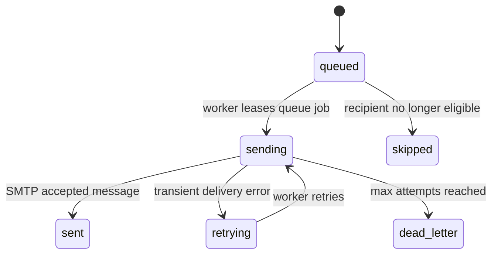

# Operational Reporting and Alerting Low-Level Design

## Scope

This document is the implementation-level companion to
[`operational-reporting-alerting.md`](operational-reporting-alerting.md).
It defines the database schema, relationships, API contracts, worker jobs,
scheduling behavior, module boundaries, and failure semantics for:

- one daily workspace health digest;
- one immediate email when provider-call failures enter a breached state;
- dashboard operational alerts;
- owner-managed schedules, thresholds, and verified recipients; and
- delivery history and retry visibility.

This is a design only. It does not introduce application code or migrations.

## V1 decisions

| Concern | Decision |
| --- | --- |
| Delivery channels | Email and authenticated dashboard only. |
| Daily frequency | One digest per completed workspace-local calendar day. |
| Immediate conditions | Provider-call failure spike only. Low evaluation metrics remain daily/dashboard signals. |
| Recipient model | Workspace owner is seeded as verified; external recipients must verify ownership. |
| Configuration access | Workspace owners only. |
| Dashboard access | Any authenticated member of the workspace. |
| Default activation | Reporting is ineffective until SMTP is configured and at least one recipient is verified. |
| Failure notification re-arm | A new immediate email is allowed only after the workspace returns to a normal state and breaches again. |
| Delivery atomicity | Each recipient has an independent queue job and delivery state. |
| Sensitive data | No transcript, audio, provider payload, call identifier, evaluator rationale, credential, or raw stack trace in email or delivery history. |
| Digests beyond daily | Weekly/monthly digests are deferred. |

## Component map



## Entity relationships



`report_deliveries` represents one immutable report or alert snapshot.
`report_delivery_targets` represents delivery to one email address. This split
is required because a single SMTP attempt may succeed for one recipient and
fail for another; retries must not resend to successful recipients.

## Database schema

All identifiers use the repository's existing 36-character UUID string
convention. All persisted timestamps are timezone-aware UTC values.

### `reporting_settings`

One row per workspace.

| Column | Type | Null | Default | Notes |
| --- | --- | --- | --- | --- |
| `id` | `String(36)` | No | UUID | Primary key. |
| `workspace_id` | `String(36)` | No | — | FK `workspaces.id ON DELETE CASCADE`; unique. |
| `daily_digest_enabled` | `Boolean` | No | `false` | Owner-controlled master toggle for daily email. |
| `timezone` | `String(64)` | No | `UTC` | Valid IANA timezone, validated with `zoneinfo.ZoneInfo`. |
| `daily_delivery_time` | `Time` | No | `09:00` | Local wall-clock time, minute precision. |
| `next_daily_digest_at` | `DateTime(tz)` | Yes | `null` | Next UTC scheduler instant; null while disabled. |
| `failure_spike_enabled` | `Boolean` | No | `true` | Immediate failure email/dashboard rule. |
| `failure_spike_threshold` | `Integer` | No | `20` | Percentage, inclusive breach comparison. |
| `failure_spike_min_calls` | `Integer` | No | `10` | Minimum trailing-window sample. |
| `task_completion_enabled` | `Boolean` | No | `true` | Daily/dashboard rule. |
| `task_completion_threshold` | `Integer` | No | `60` | Higher-is-better score. |
| `task_completion_min_evaluations` | `Integer` | No | `10` | Minimum daily sample. |
| `intent_understanding_enabled` | `Boolean` | No | `true` | Daily/dashboard rule. |
| `intent_understanding_threshold` | `Integer` | No | `60` | Higher-is-better score. |
| `intent_understanding_min_evaluations` | `Integer` | No | `10` | Minimum daily sample. |
| `required_info_capture_enabled` | `Boolean` | No | `true` | Daily/dashboard rule. |
| `required_info_capture_threshold` | `Integer` | No | `60` | Higher-is-better score. |
| `required_info_capture_min_evaluations` | `Integer` | No | `10` | Minimum daily sample. |
| `human_like_delivery_enabled` | `Boolean` | No | `true` | Uses normalized inverse of `ai_detectability_score`. |
| `human_like_delivery_threshold` | `Integer` | No | `60` | Higher-is-better normalized score. |
| `human_like_delivery_min_evaluations` | `Integer` | No | `10` | Minimum daily sample. |
| `metric_regression_enabled` | `Boolean` | No | `true` | Day-over-day metric comparison. |
| `metric_regression_points` | `Integer` | No | `10` | Inclusive absolute drop in points. |
| `metric_regression_min_evaluations` | `Integer` | No | `10` | Required on both compared days. |
| `created_at` | `DateTime(tz)` | No | DB now | Audit. |
| `updated_at` | `DateTime(tz)` | No | DB now | Updated on mutation. |

Constraints and indexes:

- unique constraint on `workspace_id`;
- check all percentages and score thresholds are between `0` and `100`;
- check all minimum samples are greater than `0`;
- index `(daily_digest_enabled, next_daily_digest_at)`;
- recalculate `next_daily_digest_at` whenever enabled, timezone, or delivery time changes.

### `report_recipients`

One row per workspace/email.

| Column | Type | Null | Default | Notes |
| --- | --- | --- | --- | --- |
| `id` | `String(36)` | No | UUID | Primary key. |
| `workspace_id` | `String(36)` | No | — | FK `workspaces.id ON DELETE CASCADE`. |
| `email` | `String(320)` | No | — | Trimmed lowercase canonical address. |
| `status` | `String(32)` | No | `pending_verification` | `pending_verification`, `verified`, `disabled`, `revoked`. |
| `is_workspace_member` | `Boolean` | No | `false` | Audit/display field; not used as authorization. |
| `verification_token_hash` | `String(255)` | Yes | `null` | SHA-256/HMAC hash only; never store raw token. |
| `verification_expires_at` | `DateTime(tz)` | Yes | `null` | Required while pending. |
| `verified_at` | `DateTime(tz)` | Yes | `null` | Set once verification succeeds. |
| `created_by_user_id` | `String(36)` | No | — | FK `users.id ON DELETE RESTRICT`. |
| `created_at` | `DateTime(tz)` | No | DB now | Audit. |
| `updated_at` | `DateTime(tz)` | No | DB now | Audit. |

Constraints and indexes:

- unique `(workspace_id, email)`;
- index `(workspace_id, status)`;
- index `verification_token_hash` for token lookup;
- a revoked address may be re-added only by explicitly reactivating the same row;
- verification success clears the token hash and expiry;
- verification tokens expire after 24 hours and are rotated on resend.

The first owner recipient is inserted as `verified` when reporting settings are
first created. Adding a non-owner or external address queues a verification
email and does not include it in reports until verified.

### `report_alert_states`

Persists the immediate-alert state machine across worker restarts.

| Column | Type | Null | Default | Notes |
| --- | --- | --- | --- | --- |
| `id` | `String(36)` | No | UUID | Primary key. |
| `workspace_id` | `String(36)` | No | — | FK `workspaces.id ON DELETE CASCADE`. |
| `alert_key` | `String(64)` | No | — | V1 value: `provider_failure_spike`. |
| `state` | `String(20)` | No | `normal` | `normal` or `breached`. |
| `episode_id` | `String(36)` | Yes | `null` | New UUID on each normal-to-breached transition. |
| `window_start` | `DateTime(tz)` | Yes | `null` | Latest evaluated trailing window. |
| `window_end` | `DateTime(tz)` | Yes | `null` | Latest evaluated trailing window. |
| `observed_value` | `Float` | Yes | `null` | Failure percentage. |
| `sample_count` | `Integer` | No | `0` | Calls in the window. |
| `breached_at` | `DateTime(tz)` | Yes | `null` | First detection in current episode. |
| `recovered_at` | `DateTime(tz)` | Yes | `null` | Most recent return to normal. |
| `last_evaluated_at` | `DateTime(tz)` | Yes | `null` | Scheduler health/diagnostic field. |
| `created_at` | `DateTime(tz)` | No | DB now | Audit. |
| `updated_at` | `DateTime(tz)` | No | DB now | Audit. |

Constraints and indexes:

- unique `(workspace_id, alert_key)`;
- index `(state, last_evaluated_at)`;
- `episode_id` must be non-null while breached;
- one email dedupe key is derived from each episode ID.

### `report_deliveries`

One immutable aggregate snapshot per daily report, immediate alert, or test.

| Column | Type | Null | Default | Notes |
| --- | --- | --- | --- | --- |
| `id` | `String(36)` | No | UUID | Primary key. |
| `workspace_id` | `String(36)` | No | — | FK `workspaces.id ON DELETE CASCADE`. |
| `report_type` | `String(32)` | No | — | `daily_digest`, `failure_spike`, `test_digest`. |
| `dedupe_key` | `String(255)` | No | — | Globally unique idempotency key. |
| `status` | `String(24)` | No | `queued` | `queued`, `sending`, `sent`, `partial_failure`, `failed`, `cancelled`. |
| `period_start` | `DateTime(tz)` | No | — | Inclusive aggregate window. |
| `period_end` | `DateTime(tz)` | No | — | Exclusive aggregate window. |
| `scheduled_for` | `DateTime(tz)` | No | — | Intended dispatch instant. |
| `payload_json` | `Text` | No | — | Versioned, immutable, safe aggregate snapshot. |
| `trigger_json` | `Text` | Yes | `null` | Rule, threshold, observed value, sample, affected-agent aggregates. |
| `payload_version` | `Integer` | No | `1` | Renderer compatibility. |
| `sent_at` | `DateTime(tz)` | Yes | `null` | Set when every non-skipped target is sent. |
| `created_at` | `DateTime(tz)` | No | DB now | Audit. |
| `updated_at` | `DateTime(tz)` | No | DB now | Audit. |

Dedupe formats:

- daily: `daily:{workspace_id}:{local_date}`;
- failure: `failure_spike:{workspace_id}:{episode_id}`;
- test: `test:{workspace_id}:{request_id}`.

Constraints and indexes:

- unique `dedupe_key`;
- index `(workspace_id, created_at DESC)`;
- index `(workspace_id, report_type, created_at DESC)`;
- index `(status, scheduled_for)`;
- check `period_end > period_start`.

`payload_json` is the source used for every retry. A retry must not rerun the
aggregation query because the underlying data may have changed.

### `report_delivery_targets`

One row and one queue job per recipient.

| Column | Type | Null | Default | Notes |
| --- | --- | --- | --- | --- |
| `id` | `String(36)` | No | UUID | Primary key. |
| `delivery_id` | `String(36)` | No | — | FK `report_deliveries.id ON DELETE CASCADE`. |
| `recipient_id` | `String(36)` | Yes | — | FK `report_recipients.id ON DELETE SET NULL`; history survives removal. |
| `email` | `String(320)` | No | — | Immutable destination snapshot. |
| `status` | `String(24)` | No | `queued` | `queued`, `sending`, `sent`, `retrying`, `failed`, `dead_letter`, `skipped`. |
| `attempts` | `Integer` | No | `0` | Mirrored for API visibility. |
| `max_attempts` | `Integer` | No | `5` | Same retry policy as queue job. |
| `last_error` | `Text` | Yes | `null` | Safe summary capped at 2,000 characters. |
| `sent_at` | `DateTime(tz)` | Yes | `null` | Successful SMTP completion. |
| `created_at` | `DateTime(tz)` | No | DB now | Audit. |
| `updated_at` | `DateTime(tz)` | No | DB now | Audit. |

Constraints and indexes:

- unique `(delivery_id, email)`;
- index `(delivery_id, status)`;
- index `(status, updated_at)`;
- do not reset a `sent` target to a sendable status;
- raw SMTP responses and stack traces are logged internally, not stored here.

## Existing data connections

The reporting tables do not duplicate conversation or evaluation rows.
Aggregation reads the existing models:

| Reporting value | Existing source |
| --- | --- |
| Workspace identity | `workspaces` |
| Owner permission and initial recipient | `memberships` joined to `users` |
| Call volume, provider outcome, dates, agent | `conversations` |
| Agent display name | `provider_agents` by provider account and provider agent ID |
| Latest completed evaluation | `conversation_evaluation_runs` |
| Metric values | `conversation_metric_scores` |
| Async execution and retries | `job_queue`, `job_attempts`, `dead_letter_jobs` |

For each conversation, reporting selects only the latest
`conversation_evaluation_runs.status == "completed"` run inside the workspace.
Scores from queued, running, or failed runs never replace the last completed
result.

Provider failure classification must be extracted into one shared helper used
by the dashboard and reporting service. Reporting must not introduce a second
interpretation of `Conversation.outcome`.

## Aggregate snapshot contract

`payload_json` uses a versioned internal shape:

```json
{
  "version": 1,
  "workspace": {"id": "...", "name": "..."},
  "reporting_date": "2026-07-16",
  "period": {"start": "...Z", "end": "...Z", "timezone": "Asia/Kolkata"},
  "summary": {
    "calls": 120,
    "provider_failures": 18,
    "provider_failure_rate": 15.0,
    "evaluated_calls": 100,
    "evaluation_coverage_rate": 83.3,
    "qa_pass_rate": 72.0,
    "average_quality": 78.4
  },
  "comparisons": {},
  "metrics": [],
  "attention_items": [],
  "affected_agents": [],
  "links": {
    "dashboard": "/dashboard?start_date=2026-07-16&end_date=2026-07-16",
    "conversations": "/conversations?..."
  }
}
```

Only aggregate counts, percentages, metric labels, agent names, and relative
authenticated paths are allowed. Email rendering prepends
`FRONTEND_APP_URL`; callers may not place arbitrary absolute URLs in the
snapshot.

## API design

Register `backend/app/api/v1/reporting.py` under `/api/v1/reporting`.

### Authorization dependency

`get_current_workspace_owner` resolves:

1. authenticated user and active workspace using existing session behavior;
2. membership matching both IDs; and
3. `Membership.role == "owner"`.

Failure is `403`; a missing active workspace remains the existing auth error.
Every repository query still includes `workspace_id`, even after authorization.

### Settings

#### `GET /api/v1/reporting/settings`

Owner only. Lazily creates safe defaults and seeds the owner recipient.

Response:

```json
{
  "settings": {
    "daily_digest_enabled": false,
    "timezone": "UTC",
    "daily_delivery_time": "09:00",
    "failure_spike": {"enabled": true, "threshold": 20, "min_calls": 10},
    "metric_rules": {},
    "regression_rule": {}
  },
  "smtp_configured": true,
  "verified_recipient_count": 1
}
```

#### `PUT /api/v1/reporting/settings`

Owner only. Full replacement of editable settings; server-managed IDs,
timestamps, and `next_daily_digest_at` are not accepted.

Validation:

- valid IANA timezone;
- `HH:MM` local time;
- thresholds in `0..100`;
- positive sample counts;
- regression points in `1..100`;
- enabling either email type requires production SMTP configuration and one
  verified recipient.

The update and recalculated `next_daily_digest_at` commit atomically.

### Recipients

#### `GET /api/v1/reporting/recipients`

Owner only. Returns recipient ID, masked/display email, status, member flag,
verification expiry, verified time, and creation time. It never returns a
verification token or hash.

#### `POST /api/v1/reporting/recipients`

Owner only.

Request: `{ "email": "ops@example.com" }`.

Behavior:

- normalize and validate;
- enforce a V1 maximum of 20 active/pending recipients per workspace;
- return the existing row for an exact duplicate;
- rotate verification state for a revoked/expired row;
- queue `REPORT_RECIPIENT_VERIFICATION_EMAIL`;
- return `202 Accepted`.

#### `POST /api/v1/reporting/recipients/{recipient_id}/resend-verification`

Owner only. Allowed only for pending or expired recipients. Rotate the token,
expire the old token, queue a new verification email, and rate-limit to one
request per recipient per 10 minutes.

#### `POST /api/v1/reporting/recipients/verify`

Unauthenticated token action.

Request: `{ "token": "..." }`.

Behavior:

- hash token before lookup;
- require pending status and unexpired token;
- atomically set verified status/time and clear token fields;
- repeated use returns a generic invalid/expired response;
- response never discloses workspace or email.

#### `PATCH /api/v1/reporting/recipients/{recipient_id}`

Owner only.

Request: `{ "status": "disabled" }` or `{ "status": "revoked" }`.
Direct transition to `verified` is rejected. Re-enabling a verified disabled
recipient does not require verification; a revoked external recipient does.

### Delivery history

#### `GET /api/v1/reporting/deliveries`

Owner only.

Query parameters:

- `report_type`;
- `status`;
- `limit` default 25, maximum 100;
- `offset` default 0.

Returns safe report metadata and target counts by status. It excludes
`payload_json`, trigger internals, recipient verification fields, and raw
errors.

#### `GET /api/v1/reporting/deliveries/{delivery_id}`

Owner only. Returns safe summary values, attention items, and each target's
masked email/status. No transcript-level data.

#### `POST /api/v1/reporting/test-digest`

Owner only. Creates a `test_digest` snapshot from the last completed local day
and queues it to currently verified recipients. Rate-limit one request per
workspace per hour and return `202` with the delivery ID.

### Dashboard extension

`GET /api/v1/dashboard` adds:

```json
{
  "operational_alerts": [
    {
      "key": "provider_failure_spike",
      "severity": "critical",
      "title": "Provider call failures are elevated",
      "observed_value": 25.0,
      "threshold": 20.0,
      "sample_count": 20,
      "window_start": "...Z",
      "window_end": "...Z",
      "affected_agents": [],
      "review_filters": {"outcome": "failed", "date_from": "...", "date_to": "..."}
    }
  ]
}
```

This endpoint computes current alert state from the same aggregation helpers;
it does not expose recipient or email-delivery configuration.

## Worker and cron design

### New queue job types

| Job type | Priority | Payload | Purpose |
| --- | ---: | --- | --- |
| `report_recipient_verification_email` | 40 | `{"recipient_id": "..."}` | Send/resent verification link. |
| `report_failure_spike_email` | 45 | `{"delivery_target_id": "..."}` | Immediate alert delivery. |
| `report_daily_digest_email` | 90 | `{"delivery_target_id": "..."}` | Daily report delivery. |
| `report_test_digest_email` | 90 | `{"delivery_target_id": "..."}` | Owner-requested test. |

Each email job contains only an internal row ID. It never embeds recipient
email, token, aggregate snapshot, or workspace data in `job_queue.payload_json`.

### Scheduler entry points

Add:

- `enqueue_due_daily_digests(db, now_utc)`;
- `evaluate_failure_spike_states(db, now_utc)`;
- `enqueue_due_reporting_jobs(db, now_utc)`, which invokes both.

`process_jobs_batch` invokes the scheduler once before leasing jobs. The
long-running `worker_loop` invokes it no more than once per minute using a
process-local monotonic timer. Multiple worker instances are safe because the
database dedupe constraints are authoritative.

No additional public cron route is required. The existing protected
`POST /api/v1/worker/drain` remains the production cron entry point. Production
must call it at least once per minute for timely failure alerts and minute-level
delivery scheduling.

### Daily scheduler transaction

For each `reporting_settings` row where:

- `daily_digest_enabled = true`;
- `next_daily_digest_at <= now`; and
- at least one verified recipient exists:

1. Resolve the preceding completed local calendar day.
2. Convert local midnight boundaries to UTC using `ZoneInfo`.
3. Build the immutable aggregate snapshot.
4. Insert `report_deliveries` with the daily dedupe key.
5. Insert one `report_delivery_targets` row per verified recipient.
6. Insert one queue job per target.
7. Calculate and store the next valid local delivery instant.
8. Commit all rows together.

If another scheduler created the dedupe key first, the losing transaction
rolls back only that workspace operation and reloads the existing delivery.
It does not log or treat the duplicate as an operational failure.

DST behavior:

- ambiguous local delivery times use the first occurrence;
- nonexistent local times move forward to the first valid local minute;
- the report period always follows actual local-midnight boundaries, so it may
  represent 23 or 25 UTC hours.

### Failure-spike scheduler transaction

For each workspace with the rule enabled:

1. Aggregate calls in `[now - 1 hour, now)`.
2. Compute provider failure percentage when sample count meets the minimum.
3. Lock or create the workspace's `report_alert_states` row.
4. Apply the transition:
   - normal + breach: create episode ID, set breached, create delivery;
   - breached + breach: update observed state only, no delivery;
   - breached + normal/insufficient sample: set normal and recovered time;
   - normal + normal: update observation only.
5. For a new episode, snapshot aggregate data, create targets, and enqueue jobs
   in the same transaction.

The unique `(workspace_id, alert_key)` state row and failure delivery dedupe key
make overlapping cron invocations safe.

### Delivery job state machine



Before sending, the worker reloads the target and:

- exits successfully if already `sent` or `skipped`;
- marks pending verification, disabled, or revoked recipients as `skipped`;
- uses the target's email snapshot only after checking the current recipient;
- marks `sending`, renders from the immutable payload, and sends outside any
  long-running database transaction;
- persists `sent` or a safe error summary afterward.

Queue retries remain controlled by existing `mark_job_failed`. When the queue
job reaches dead letter, synchronize the target to `dead_letter`. Recompute the
parent delivery status after every target terminal transition:

- all sent/skipped: `sent`;
- sent plus failed/dead-letter: `partial_failure`;
- all failed/dead-letter: `failed`;
- otherwise: `sending` or `queued`.

A report-delivery failure never changes conversation, import, evaluation, or
dashboard source data.

## Service and file boundaries

### Backend

| File | Responsibility |
| --- | --- |
| `backend/app/models/reporting.py` | Four reporting SQLAlchemy models and status constants. |
| `backend/app/schemas/reporting.py` | Settings, recipient, delivery, verification, and alert contracts. |
| `backend/app/api/v1/reporting.py` | Owner-scoped settings/recipient/history/test endpoints and token verification. |
| `backend/app/api/deps.py` | Add `get_current_workspace_owner`. |
| `backend/app/services/reporting_aggregation.py` | Period boundaries, latest-evaluation selection, metrics, comparisons, agents, attention rules. |
| `backend/app/services/reporting_scheduler.py` | Due daily scans, failure state transitions, snapshot/dedupe creation. |
| `backend/app/services/report_delivery_service.py` | Target eligibility, rendering dispatch, state transitions, parent status. |
| `backend/app/services/report_recipient_service.py` | Recipient normalization, token generation/hashing, resend rules, verification. |
| `backend/app/services/report_email_templates.py` | Pure text/HTML renderers from payload version 1. |
| `backend/app/services/email_service.py` | Extract generic SMTP send primitive; retain magic-link behavior. |
| `backend/app/services/queue_service.py` | Reuse unchanged queue contract; no reporting-specific query logic. |
| `backend/app/worker.py` | Dispatch new job types, run scheduler scan, synchronize dead letters. |
| `backend/app/api/v1/dashboard.py` | Reuse aggregation service and append operational alerts. |
| `backend/app/api/v1/api.py` | Register reporting router. |
| `backend/app/core/config.py` | Add verification TTL and recipient/test rate-limit settings if configurable. |
| `backend/alembic/versions/0006_reporting_alerting.py` | Create tables, constraints, and indexes. |

### Frontend

| File | Responsibility |
| --- | --- |
| `frontend/src/pages/ReportingSettingsPage.tsx` | Schedule, thresholds, recipients, test send, delivery history. |
| `frontend/src/pages/ReportRecipientVerifyPage.tsx` | Public token success/expired/invalid state. |
| `frontend/src/components/OperationalAlerts.tsx` | Dashboard current-state alert cards. |
| `frontend/src/api/types.ts` | Reporting settings, recipient, delivery, and alert types. |
| `frontend/src/api/endpoints.ts` | Reporting API client functions. |
| `frontend/src/App.tsx` | Add `/settings/reporting` and `/reporting/verify`. |
| `frontend/src/components/AppLayout.tsx` | Add Reporting under settings navigation. |
| `frontend/src/pages/DashboardPage.tsx` | Render operational alerts and filtered review links. |

The verification route is outside `RequireAuth`; all other reporting routes
remain authenticated.

## Email rendering rules

### Daily digest

- Subject: `VaaniEval daily report — {attention_count} items need attention`
  or `VaaniEval daily report — all monitored signals are healthy`.
- Include workspace name and local reporting date.
- Include aggregate counts, rates, deltas, metric summaries, and affected-agent
  aggregates.
- Link to authenticated dashboard and filtered conversation views.

### Immediate failure alert

- Subject: `VaaniEval alert — call failures are elevated`.
- Include observed rate, configured threshold, sample count, trailing window,
  affected-agent aggregates, and authenticated review link.
- Do not include individual call IDs or raw provider outcomes.

### Verification email

- Include single-use link:
  `{FRONTEND_APP_URL}/reporting/verify?token={raw_token}`.
- Do not identify the workspace until the recipient successfully verifies.
- Raw token exists only during request construction and must not be logged.

All dynamic labels are HTML escaped. Every message is multipart plain text and
HTML. URLs are built server-side from `FRONTEND_APP_URL`.

## Error handling and observability

- Invalid owner input returns structured `400` validation errors.
- Cross-workspace IDs return `404`, avoiding resource disclosure.
- SMTP misconfiguration prevents enabling email and test sends, but does not
  affect dashboard alerts.
- Scheduler aggregation errors are logged per workspace and do not stop other
  workspaces from being scanned.
- A failed SMTP send is retryable; a malformed immutable payload is terminal.
- Store only safe error categories such as `smtp_timeout`,
  `smtp_authentication_failed`, `invalid_payload_version`, or
  `recipient_ineligible` in user-visible history.

Operational counters/log fields:

- scheduler scan duration and workspaces scanned;
- due daily reports and new failure episodes;
- delivery target queue age;
- target sent/retried/dead-letter counts;
- duplicate dedupe conflicts;
- verified/pending recipient counts; and
- last successful cron drain time.

## Security and privacy checks

- Every table query includes `workspace_id` or joins through a
  workspace-scoped parent.
- Owner authorization is checked server-side; frontend hiding is not security.
- Verification tokens have at least 32 random bytes and are stored only as a
  hash.
- Recipient lists and delivery history are owner-only.
- Dashboard alert data contains only aggregate workspace data.
- Email deep links require the normal authenticated application session.
- Payload snapshots use an allow-list serializer rather than serializing ORM
  objects.
- Do not place credentials, transcripts, evaluator rationales, raw errors, or
  provider payloads into queue payloads, report payloads, logs, or email.

## Migration and rollout

1. Add tables and indexes with no behavior change.
2. Deploy read/write settings and recipient APIs with all email toggles off.
3. Seed defaults lazily when an owner opens reporting settings.
4. Deploy aggregation and dashboard alerts.
5. Deploy scheduler and email jobs behind `REPORTING_ENABLED=false`.
6. Configure SMTP and confirm the one-minute cron drain.
7. Enable reporting in one internal workspace and validate delivery history.
8. Enable the feature globally after dedupe, retry, and privacy checks pass.

Rollback disables scheduler creation first. Existing immutable delivery history
may remain readable; queued report jobs can be cancelled without modifying
conversation or evaluation records.

## Required tests

### Persistence and authorization

- one settings row per workspace;
- unique normalized recipient per workspace;
- recipient and delivery workspace isolation;
- owner allowed, member denied for configuration/history;
- recipient verification expiry, replay prevention, rotation, and revocation;
- per-recipient target uniqueness.

### Aggregation

- local-day boundaries including 23/25-hour DST days;
- `started_at` fallback to `created_at`;
- latest completed evaluation only;
- quality normalization for `ai_detectability_score`;
- QA gate parity with dashboard;
- threshold equality and minimum-sample boundaries;
- prior-day delta with insufficient prior sample.

### Scheduling and idempotency

- repeated/parallel daily scan creates one delivery;
- normal-to-breached creates one episode and one delivery;
- persistent breach suppresses duplicates;
- recovery then re-breach creates a new episode;
- no verified recipients creates no send targets;
- timezone/time update correctly recalculates next execution.

### Delivery

- one job per target;
- successful target is never resent during another target's retry;
- disabled/revoked recipient is skipped before send;
- transient SMTP failure retries;
- max attempts synchronize dead-letter state;
- parent status becomes sent, partial failure, or failed correctly;
- delivery failure never mutates reporting source data.

### Frontend

- owner settings edit and validation;
- non-owner permission state;
- verification success/expired/invalid states;
- delivery-history pagination and status display;
- dashboard healthy and breached states;
- exact-date and filtered-conversation links.

