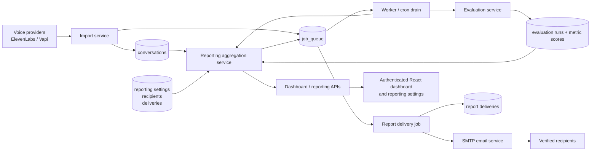
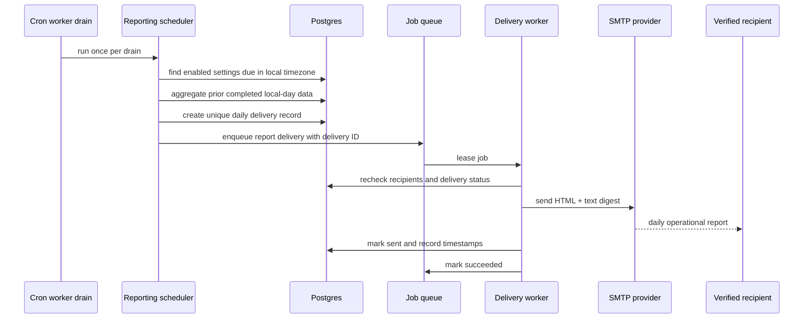

# Operational Reporting and Alerting Design

## Purpose

Turn imported call outcomes and completed VaaniEval evaluations into a reliable workspace reporting loop:

- Daily health digest at a workspace-selected local time.
- Immediate notification for material provider-call failure spikes.
- Actionable current-state reporting in the authenticated dashboard.
- Owner-controlled, verified recipients, thresholds, and delivery history.

This builds on the existing FastAPI API, SQLAlchemy models, SMTP email delivery, retrying `job_queue`, and cron-driven worker drain. It does not add public reporting pages, expose transcripts in email, or change call import/evaluation behavior.

## Product decisions

| Decision | V1 behavior |
| --- | --- |
| Daily report | Always send a digest for the preceding completed local calendar day, including healthy days. |
| Immediate report | Send only for provider-reported call-failure spikes; low evaluation metrics remain in the daily digest and dashboard. |
| Schedule | Workspace owner selects an IANA timezone and local delivery time; default `09:00`. |
| Recipients | Seed the workspace owner as confirmed. Added external emails require one-time verification. |
| Email privacy | Aggregate metrics, counts, deltas, agent names, and authenticated deep links only. No transcript, call ID, evaluator evidence, or raw provider payload. |
| Metric direction | Reporting uses a higher-is-better quality scale. The existing `ai_detectability_score` is normalized before comparison. |
| Permissions | Only a `Membership.role == "owner"` user may configure reporting. Any authenticated workspace member may see dashboard alerts. |

## System design

### Component and data flow

The worker remains the only background mechanism. Each authenticated cron drain finds due schedules and active failure windows, then queues idempotent delivery jobs. Aggregation and SMTP delivery stay separate so a slow or failing email provider cannot block schedule discovery.

### Daily digest lifecycle

### Immediate failure alert lifecycle

```mermaid
stateDiagram-v2
  [*] --> Normal
  Normal --> Breached: 1-hour failure rate >= threshold\nand calls >= minimum
  Breached --> AlertQueued: first breach for workspace episode
  AlertQueued --> Breached: delivery queued or sent
  Breached --> Normal: rate is normal\nor sample falls below minimum
  Breached --> Breached: persistent breach; suppress duplicate email
```

The default immediate condition is a provider failure rate of at least 20% in the trailing hour across at least 10 calls. It emits one notification, re-arms only after the window normalizes, and then may notify on a subsequent breach.

## Reporting semantics

### Source-of-truth rules

| Signal | Source | Inclusion rule |
| --- | --- | --- |
| Call volume and provider failures | `conversations` | Period membership uses `started_at`, falling back to `created_at`. A failure uses the current provider-outcome error classification. |
| QA pass rate | Latest completed evaluation run and scores | Preserve the existing QA gate: overall average >= 80 and every metric >= 60. |
| Evaluation coverage | Conversations plus latest completed evaluation runs | Completed evaluations divided by all calls in the period. |
| Metric averages | Latest completed metric score for each call | Average only completed scores for that metric. |
| Agent context | Conversation provider-agent association | Aggregate by agent; email never lists individual calls. |

Persist all timestamps in UTC. Convert the workspace’s selected timezone only when deriving local-day boundaries, preserving intended reporting days across daylight-saving transitions.

### Defaults and attention rules

| Rule | Default | Sample requirement | Surface |
| --- | --- | --- | --- |
| Immediate provider failure spike | >=20% in trailing 1 hour | >=10 calls | Dashboard and immediate email |
| Low task completion | Daily average <60 | >=10 evaluated calls | Dashboard and daily digest |
| Low intent understanding | Daily average <60 | >=10 evaluated calls | Dashboard and daily digest |
| Low required-info capture | Daily average <60 | >=10 evaluated calls | Dashboard and daily digest |
| Low human-like delivery quality | Normalized daily average <60 | >=10 evaluated calls | Dashboard and daily digest |
| Metric regression | Daily average down >=10 points from prior local day | >=10 evaluations on both days | Dashboard and daily digest |

Owners may enable/disable individual rules and change thresholds, minimum samples, timezone, and schedule. Validate all percentages as 0–100, sample counts as positive integers, timezones as valid IANA names, and delivery time to minute precision.

### Email content

Every daily digest contains:

1. Workspace name, reporting date, and link to the exact dashboard period.
2. Calls, provider failure rate, QA pass rate, evaluation coverage, and average quality with comparable prior-day deltas.
3. Attention items ordered by severity: failure issue, low metric, then metric regression. Each includes observed value, threshold, sample, and affected-agent context.
4. A summary of task completion, intent understanding, required-info capture, and normalized human-like delivery quality.
5. The most affected agents represented only by aggregate counts/rates and links to filtered review queues.
6. A clear healthy-state message when no rule is breached.

Immediate failure email is shorter: failure rate, affected-call count, rolling window, affected agents, and an authenticated review link.

## Persistence design

Add an Alembic migration and SQLAlchemy models.

### `reporting_settings`

One row per workspace (`workspace_id` unique, cascading deletion).

| Field group | Fields and defaults |
| --- | --- |
| Schedule | `daily_digest_enabled`, `timezone` (`UTC` until configured), `daily_delivery_time` (`09:00`). |
| Immediate alert | `failure_spike_enabled=true`, `failure_spike_threshold=20`, `failure_spike_min_calls=10`. |
| Low-score rules | Explicit enabled/threshold/min-sample columns for all four existing metrics; defaults `true`, `60`, `10`. |
| Regression | `metric_regression_enabled=true`, `metric_regression_points=10`, `metric_regression_min_evaluations=10`. |
| Audit | `created_at`, `updated_at`. |

Use typed columns rather than opaque JSON so validation, queries, migrations, and future analytics are reliable.

### `report_recipients`

One record per normalized lowercase workspace/email pair.

| Field | Meaning |
| --- | --- |
| `workspace_id`, `email` | Recipient ownership and normalized address. |
| `status` | `pending_verification`, `verified`, `disabled`, or `revoked`. |
| `verification_token_hash`, `verification_expires_at`, `verified_at` | One-time verification state; store a hash only. |
| `created_by_user_id`, `created_at`, `updated_at` | Audit trail. |

The initial owner recipient is created verified. External recipients receive a short-lived, single-use verification link and do not need a product account.

### `report_deliveries`

Stores report queueing and send outcome. A unique `dedupe_key` prevents duplicates under retry or overlapping cron runs.

| Field | Meaning |
| --- | --- |
| `workspace_id`, `report_type` | `daily_digest` or `failure_spike`. |
| `period_start`, `period_end` | UTC data window. |
| `dedupe_key` | Workspace + type + local date for daily; workspace + breach episode for immediate alerts. |
| `status` | `queued`, `sending`, `sent`, `failed`, or `dead_letter`. |
| `payload_json` | Immutable aggregate snapshot for consistent retries; no transcript/raw call content. |
| `trigger_json` | Threshold, observed value, sample size, and affected-agent summary. |
| Timestamps/errors | `scheduled_for`, `sent_at`, `last_error`, `created_at`, `updated_at`. |

Index workspace/history lookups, delivery status, schedule lookup, and the unique dedupe key.

## Backend design

### Services and worker jobs

Create a reporting service that:

- resolves exact local-day boundaries and dashboard-link query parameters;
- fetches the same latest-completed evaluation records as the dashboard;
- calculates aggregates, deltas, agent summaries, and attention items;
- evaluates configured threshold rules and creates immutable report snapshots;
- finds due daily schedules and immediate failure-spike transitions; and
- transactionally creates delivery rows and jobs.

Add the `REPORT_DELIVERY` queue type with payload `{ "delivery_id": "..." }`. Dispatch it from `backend/app/worker.py` to a delivery service. Existing retry/backoff and dead-letter behavior handles transient SMTP errors.

Call `enqueue_due_reporting_jobs` at the beginning of `process_jobs_batch` and in the long-running worker loop before job leasing. It is safe every minute, creates at most one delivery per dedupe key, and never sends SMTP inline or holds a transaction while sending.

### Email delivery

Extend the existing SMTP service with report rendering:

- Send a multipart `EmailMessage` with accessible plain text and restrained HTML.
- Use subjects such as `VaaniEval daily report — 3 items need attention` and `VaaniEval alert — call failures are elevated`.
- Build links using `FRONTEND_APP_URL`, and route only to authenticated product pages.
- Fail closed when production SMTP is incomplete. Settings can be saved, but enabling reporting or sending a test digest returns an actionable configuration error.

### API contract

Register an authenticated `/api/v1/reporting` router.

| Endpoint | Access | Behavior |
| --- | --- | --- |
| `GET /reporting/settings` | Owner | Return settings and recipient statuses; lazily create safe defaults if absent. |
| `PUT /reporting/settings` | Owner | Validate/persist schedule and threshold policy. |
| `POST /reporting/recipients` | Owner | Add an external recipient or resend verification. |
| `POST /reporting/recipients/verify` | Token action | Consume valid token and activate recipient without requiring an account. |
| `PATCH /reporting/recipients/{id}` | Owner | Enable, disable, or revoke; never directly verify external recipients. |
| `GET /reporting/deliveries` | Owner | Paginated history with safe aggregate metadata/statuses. |
| `POST /reporting/test-digest` | Owner | Queue labelled test digest to verified recipients; rate-limit once/workspace/hour. |

Extend `GET /api/v1/dashboard` with `operational_alerts`, sorted by severity. Each item supplies stable type/key, title, severity, observed value, threshold, sample, UTC window, affected agents, and safe review filters. Add exact `start_date`/`end_date` support to the dashboard UI so digest links show their intended completed local day.

Add `get_current_workspace_owner`, validating that the active user’s membership in the current workspace has `owner` role. Leave existing dashboard and conversation access unchanged.

## Frontend design

### Dashboard

Add an `Operational alerts` section after dashboard summary cards:

- Healthy empty state when no active rule is breached.
- Rank failure spikes before critical low metrics and regressions.
- Show observed value, threshold, sample size, period/window, affected agents, and a `Review calls` action.
- Clearly distinguish provider call failures from QA pass failures.
- Reuse existing metric bars, agent table, trends, and conversation review queue rather than duplicating charts.

### Reporting settings

Add `/settings/reporting` to the authenticated app shell. Owners can control:

- daily-digest toggle, timezone, and local delivery time;
- immediate failure policy, four low-score policies, and regression policy;
- recipient state, resend verification, disable, and remove actions;
- recent delivery history with report type, period, status, sent time, and safe failure summary; and
- a queued test-digest action with rate-limit feedback.

Non-owners see a clear read-only permission state if they navigate directly. Add a small public token-verification page that shows success, expiry, or invalid-link feedback without exposing recipient or workspace data.

## Security, privacy, and reliability

- Scope every settings, recipient, delivery, and aggregation query to `workspace_id`; validate client IDs before use.
- Store verification-token hashes only, expire/consume tokens, rotate on resend, normalize addresses, and cap recipients per workspace.
- Escape workspace/agent labels in HTML email and redact credentials, SMTP responses, stack traces, and verification tokens from user-visible history.
- Keep every report, preview, history, and dashboard route authenticated except token verification; do not create public reports.
- Use unique delivery keys and state transitions to make scheduler retries idempotent. A retry sends only a still-queued or safely leased record.
- Monitor report queue age, report job failure/dead-letter rate, daily digest sends, and immediate-alert volume using existing worker logs and cron monitoring.

## Implementation sequence

1. **Foundation:** models, migration, owner dependency, schemas, and workspace-isolated settings/recipient/delivery APIs.
2. **Aggregation:** reusable dashboard primitives, local-day windows, thresholds, snapshots, and alert contracts.
3. **Scheduling/delivery:** due-schedule scan, failure transition detection, dedupe, queue dispatch, SMTP templates, and cron integration.
4. **Product UI:** dashboard alert section, exact date links, reporting settings, recipient verification, and history.
5. **Hardening:** test-digest rate limit, email QA, seeded end-to-end scenarios, production SMTP/cron readiness, and monitoring.

## Test and acceptance plan

### Backend tests

- Local-day boundaries across UTC offsets/daylight-saving transitions, timestamp fallback, sparse periods, completed-evaluation-only selection, and metric normalization.
- Exact threshold/minimum-sample boundaries for all low-score and regression rules.
- Failure state transitions: below threshold, first crossing, persistent suppression, recovery, and later re-breach.
- Dedupe and transaction behavior proving repeat scheduler runs create one delivery only.
- Owner authorization, non-owner denial, workspace isolation, invalid timezone/schedule/email values, verification expiry/replay/resend, and recipient disable/remove.
- SMTP success/failure, queue retry/backoff/dead-letter, safe delivery-history errors, and dashboard alert ordering/payloads.

### Frontend and release validation

- Dashboard loading/error/healthy/alerted states at desktop and mobile widths.
- Settings persistence/errors, recipient verification feedback, recipient actions, and history pagination.
- Build with `npm --prefix frontend run build` and run the backend test suite.
- Seed one healthy and one breached workspace; verify one daily digest, one immediate alert, no duplicate email during persistent breach, recovery/re-breach, and authenticated deep links.
- Before production enablement, configure SMTP and minute-level cron drain, trigger a test digest, and inspect the delivery record plus worker logs.

## Explicit V1 non-goals

- Per-call immediate alerts or low-metric immediate emails.
- Transcript, evaluator rationale, audio, or raw provider payload in email.
- Per-agent schedules or recipient groups.
- SMS, Slack, webhook, or paging integrations.
- Statistical anomaly detection beyond configured thresholds and day-over-day regression.
- Public reporting pages, report exports, or public email previews.
