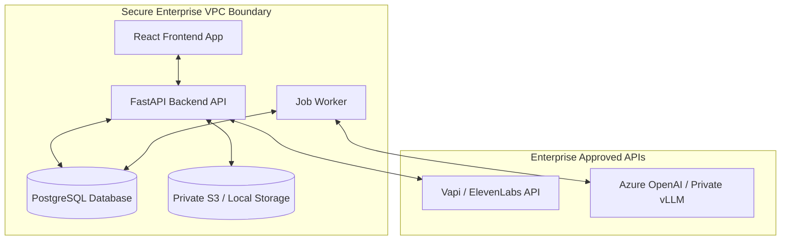

# Self-Hosted Open Source vs. Closed-Source Voice AI Evaluations: A Compliance & Security Analysis

Evaluating production voice AI agents requires capturing, processing, and analyzing high-fidelity audio streams and conversation transcripts. In highly regulated sectors—such as healthcare, financial services, insurance, and telecommunications—these datasets are subject to stringent legal and security frameworks.

This analysis evaluates the compliance advantages of the self-hosted, open-source approach represented by **VaaniEval** compared to closed-source Software-as-a-Service (SaaS) alternatives.

---

## 1. Why Voice AI Evaluation is a Compliance Minefield

Voice data is uniquely sensitive. Unlike static database records or text-only chatbot logs, voice interactions pose multi-dimensional data privacy risks:

1. **Biometric Identifiability (GDPR Classifications):** Voiceprints, tone, cadence, and vocal characteristics are classified as biometric data. Under frameworks like the GDPR, processing biometric data for identification purposes carries strict consent requirements and high regulatory penalties.
2. **Unstructured PII and PHI:** During voice interactions, customers frequently speak Protected Health Information (PHI) or Personally Identifiable Information (PII) such as Social Security Numbers, credit card numbers, dates of birth, and home addresses. Unlike structured fields, this information cannot be easily isolated without transcribing and scanning the entire audio file.
3. **The Sub-Processor Chain Multiplier:** A typical SaaS voice AI stack involves multiple hops:
   ```
   Customer Voice ──> Voice Gateway (Vapi/ElevenLabs) ──> Evaluation SaaS ──> Evaluator LLM (OpenAI/Anthropic)
   ```
   For every third-party SaaS introduced, the organization must perform vendor risk assessments, sign legal agreements, and audit sub-processors.

---

## 2. Core Compliance Frameworks & Impact on Voice AI

| Compliance Framework | Focus Area | Voice AI Impact / SaaS Risks |
| :--- | :--- | :--- |
| **HIPAA** *(Health Insurance Portability & Accountability Act)* | Security and privacy of Protected Health Information (PHI). | Any audio or transcript containing health conditions, patient names, or medical records is PHI. SaaS providers must sign a **Business Associate Agreement (BAA)**. Standard SaaS pricing models often lock BAAs behind expensive enterprise tiers. |
| **GDPR** *(General Data Protection Regulation - EU 2016/679)* | Data sovereignty, user consent, and the "Right to Erasure" (Article 17). | Audio recordings contain biometric data. If data is stored on a US-based SaaS database without a robust data transfer agreement (e.g., standard contractual clauses), it violates data transfer restrictions. Data deletion requests must propagate to all backups and sub-processors. |
| **PCI-DSS v4.0** *(Payment Card Industry Data Security Standard)* | Security of cardholder payment data (PAN, CVV). | Voice agents capturing payment info in audio or transcripts bring the evaluation platform into the PCI scope. Audio recordings containing cardholder data must be encrypted and redacted to prevent accidental storage of CVV/PAN. |
| **SOC 2 Type II** *(Security, Confidentiality, & Privacy)* | Verification of an organization's security controls over time. | Enterprise purchasing teams require third-party SaaS vendors to have an active SOC 2 Type II report. Startup SaaS providers often only have SOC 2 Type I or lack audits entirely, delaying procurement for months. |
| **CCPA/CPRA** *(California Consumer Privacy Act)* | Consumer rights over data deletion, tracking, and minimization. | Requires enterprises to know exactly where consumer data is stored and be able to delete all transcripts and recordings upon request. Closed-source SaaS makes verification of deletion difficult. |

---

## 3. Closed-Source Voice AI Eval Providers: How They Deal with Compliance

A growing ecosystem of closed-source startups and generalist LLM evaluation tools focus on voice AI evaluations and simulation. However, their closed SaaS architecture introduces specific compliance bottlenecks.

### Competitor Landscape & Compliance Coping Mechanisms

*   **Hamming AI:** Focuses on voice-native simulation, persona libraries, and production call replay.
    *   *SaaS Compliance Strategy:* Offers SOC 2 compliance and will sign Business Associate Agreements (BAAs) for HIPAA compliance, but typically restricts these to high-priced Enterprise tiers.
    *   *Compliance Bottleneck:* Telemetry, audio recordings, and evaluation logs are transferred to Hamming's managed cloud environment, requiring security teams to review their cloud infrastructure.
*   **Coval:** A simulation-first evaluation framework for automated regression testing.
    *   *SaaS Compliance Strategy:* Integrates with CI/CD pipelines to run test agents.
    *   *Compliance Bottleneck:* Test logs and scenario details reside in Coval’s cloud databases, presenting risk if proprietary agent prompt guidelines or customer-like test profiles are exposed.
*   **Braintrust:** A generalist LLM observability platform that includes audio tracing.
    *   *SaaS Compliance Strategy:* Offers a hybrid enterprise architecture where evaluation data is stored in the customer's cloud storage (e.g., AWS S3), while the control plane remains SaaS.
    *   *Compliance Bottleneck:* While data-plane isolation is supported, the hybrid tier is highly expensive, making compliance cost-prohibitive for early-stage or mid-sized teams.
*   **Maxim AI:** A lifecycle platform covering testing, prompt engineering, and production observability.
    *   *SaaS Compliance Strategy:* Supports private cloud deployments (VPC) for large enterprise customers alongside their standard SaaS model.
    *   *Compliance Bottleneck:* Locked behind enterprise contracts, requiring lengthy legal and sales negotiations before developers can start using it in a compliant manner.
*   **Tuner & Roark:** Specialized post-production voice observability platforms.
    *   *SaaS Compliance Strategy:* Rely on client-side data masking and ingestion endpoints that use standard HTTPS transport security.
    *   *Compliance Bottleneck:* If redactors fail to catch PII in real-time, the raw PII is written to the vendor's databases, creating immediate compliance incidents.
*   **Noveum:** Focuses on on-premises deployments for regulated industries.
    *   *SaaS Compliance Strategy:* Sells true on-premises licenses where the product runs locally.
    *   *Compliance Bottleneck:* Because the codebase is closed-source, enterprise security teams must rely on black-box audits and vendor guarantees rather than conducting direct code audits.

### SaaS Compliance Gaps & Friction Points
1. **Prolonged Procurement Cycles:** Security reviews for SaaS platforms processing voice data typically take **3 to 6 months** as teams audit the vendor’s SOC 2, penetration test reports, sub-processors, and disaster recovery plans.
2. **Hidden Sub-processors:** SaaS eval platforms run evaluations using external LLM APIs (e.g., OpenAI, Anthropic). The customer is forced to inherit the vendor’s sub-processors, multiplying the compliance risk.
3. **Data Training Leakage:** Many SaaS platforms retain user data to improve their internal algorithms and evaluator models. Preventing this requires custom contractual carve-outs.
4. **Data Residency Violated:** Ingested calls are stored in the SaaS vendor’s centralized region (usually US-East), violating strict regional data residency rules in the EU, Canada, or APAC.

---

## 4. The Self-Hosted Paradigm: How VaaniEval Streamlines Compliance

VaaniEval's open-source, self-hosted model addresses compliance concerns by shifting data control back to the enterprise.



### 1. Data Residency & Complete Perimeter Control
Because VaaniEval is self-hosted, all conversation transcripts, audio playback streams, and evaluation metadata remain inside the enterprise’s private network boundary (e.g., AWS, GCP, Azure, or local bare-metal servers). 
*   **Zero Leakage:** No data is telemetry-shipped to a third-party startup server.
*   **Database Sovereignty:** Supported databases (SQLite and PostgreSQL) run locally or on a private managed instance (e.g., AWS RDS or self-hosted Neon). The enterprise controls access rules, backups, and network policies.

### 2. Direct Integration with Compliant LLM Endpoints
SaaS evaluation platforms act as middlemen, routing your raw conversations to LLMs. VaaniEval cuts out the intermediary:
*   **Custom API Routing:** VaaniEval connects directly to the enterprise’s pre-approved, HIPAA-compliant endpoints. By setting `OPENAI_API_BASE` in the backend configuration, evaluations can route to **Azure OpenAI Service** (with zero data retention guarantees) or to self-hosted models running via **vLLM / Ollama** inside the same VPC.
*   **No New Sub-processors:** There is no third-party evaluation company in the network route. The compliance path is direct: Enterprise ──> Approved LLM.

### 3. Open Source Extensibility for Data Redaction
Because VaaniEval is open-source (MIT License), developers have full access to customize the ingestion and storage layers:
*   **Pre-Ingestion Masking:** Developers can modify the provider adapters (`backend/app/providers/elevenlabs/` or `vapi/`) to scrub PII/PHI (like names, telephone numbers, and account numbers) before storing transcripts in the database.
*   **Biometric Data Management:** Enterprises can implement automatic retention limits, deleting audio files (`docs/v2-plan/audio-scalability-plan.md`) from storage after scoring is complete while keeping only anonymized scores, fulfilling GDPR's data minimization principles.

### 4. Direct Auditability
Security officers do not need to rely on high-level security questionnaires or black-box assertions.
*   **Code Transparency:** The security team can inspect 100% of the FastAPI and React codebase to verify that no backdoors, unapproved webhooks, or diagnostic telemetry are present.
*   **Secure Credential Handling:** VaaniEval uses the `CREDENTIAL_ENCRYPTION_KEY` environment variable to encrypt third-party voice platform API keys (Vapi, ElevenLabs) at rest in the database, protecting keys from local database compromises.

---

## 5. Security & Compliance Deployment Blueprint

To deploy VaaniEval in a fully compliant enterprise environment, follow this architectural setup:

### Step 1: Network Isolation
*   Deploy the `frontend/` static assets and `backend/` FastAPI container inside a **Private Subnet** of your Virtual Private Cloud (VPC).
*   Use an Internal Application Load Balancer (ALB) to restrict access to employees on the corporate VPN/Tailscale network.

### Step 2: Database and Storage Security
*   Deploy a managed PostgreSQL database with **Encryption at Rest** enabled.
*   Store media files (voice recordings) in an enterprise-managed private bucket (e.g., AWS S3) configured with IAM Roles (avoiding long-lived access keys) and Object Lifecycle Policies to auto-delete audio files after 14 days (minimizing biometric storage risks under GDPR).

### Step 3: Zero-Retention LLM Routing
Configure `backend/.env` to route evaluations only to zero-retention or private endpoints:
```env
# Point to your enterprise Azure OpenAI instance to ensure HIPAA BAA coverage
OPENAI_API_BASE=https://your-enterprise-resource.openai.azure.com/openai/deployments/your-deployment/
OPENAI_API_KEY=your-secure-azure-key

# Enable encryption of all DB-stored third-party credentials
CREDENTIAL_ENCRYPTION_KEY=super-secret-32-byte-hex-key
```

### Step 4: Verification & Audit Logs
*   Enable container logging (AWS CloudWatch, GCP Cloud Logging) for both the FastAPI server and the worker process to maintain a clear audit trail of who accessed which call logs and when.
*   Run container vulnerability scanning (e.g., Trivy, Snyk) during the CI/CD pipeline build of the VaaniEval containers.

---

## Conclusion

For enterprises handling voice interactions containing PII, PHI, or cardholder data, closed-source SaaS evaluation platforms represent a significant compliance burden, high recurring costs, and procurement friction. 

By leveraging **VaaniEval** as a self-hosted, open-source workspace, organizations eliminate third-party SaaS risks, enforce data residency, integrate with approved LLMs, and inspect their code, accelerating their time-to-market.
